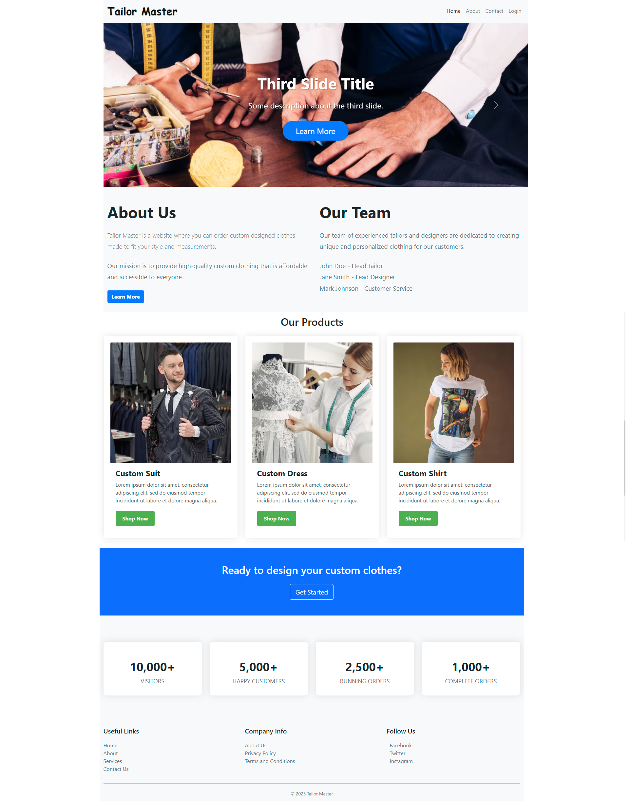

# tailor-master-web-app-using-golang

Tailor Master is a web application designed for tailoring shops and boutiques to manage orders and customer information. It includes a variety of features to help tailors and boutique owners manage their businesses more efficiently.

# Description

Tailor Master is a web application designed for tailoring shops and boutiques to manage orders and customer information. It aims to streamline the ordering process, improve customer experience, and increase the efficiency of tailoring shops and boutiques. The web application provides features such as order and inventory management, measurement input, customization tools, payment processing, and appointment scheduling.

## Technology Stack

The Tailor Master web application is built using the following technology stack:
- Go language
- Gin web framework
- MySQL database
- HTML, CSS, and JavaScript


## Database Setup
To set up the database for the `Tailor Master` web application, follow these steps:

1. Install `MySQL` on your machine if you haven't already done so.
2. Create a new database in MySQL and name it `tailor_master`.
3. Create a new user in MySQL and grant them all privileges to the `tailor_master` database.
4. Modify the `config.yaml` file to include the correct `database information`, including the `username`, `password`, and `host`.
5. To migrate any necessary schema changes, use the `Golang` database migration tool called `goose`. Follow these steps to migrate schema changes:

6. Install goose by running the following command: 
```go get -u github.com/pressly/goose/cmd/goose```
7. Run migrations by navigating to the project directory and running `goose up`. This will apply any new migrations to the database.

## Contributing
Contributions to the Tailor Master web application are welcome and appreciated. To contribute, follow these steps:

1. Fork the repository to your own GitHub account.
2. Create a new branch for your changes and make your changes in that branch.
3. Submit a pull request to merge your changes into the main repository.
4. Wait for a code review and address any feedback or issues that arise.


To ensure that contributions are in line with the project's goals and standards, please follow these guidelines:

- Write clear and concise code with appropriate comments and documentation.
- Adhere to the project's existing code style and formatting conventions.
- Test your changes thoroughly and make sure they do not break any existing functionality.
- Write comprehensive tests for new functionality.
- Avoid introducing unnecessary dependencies or increasing complexity unless it is necessary to achieve the project's goals.

# Core Features

- Order management: Manage orders, including creating new orders, tracking order progress, and updating order statuses.
- Customer management: Manage customer information, including contact details, measurements, order history, and preferences.
- Inventory management: Manage fabrics and other materials, including tracking stock levels, reordering when necessary, and adding new materials to the inventory.
- Measurement input: Allow customers to input their own measurements, either through a guided process or by entering measurements directly.
- Design and customization tools: Allow customers to design and customize their own clothing, including choosing fabrics, styles, and details like buttons and trim.
- Alteration requests: Allow customers to request alterations to existing garments, including entering details about the desired changes and attaching photos or other relevant information.
- Payment processing: Accept payments from customers, including integrating with popular payment gateways or offering other payment options.
- Appointment scheduling: Allow customers to schedule appointments with the tailor or boutique, including setting availability and sending reminders.
- Reporting and analytics: Generate reports and analytics on order history, customer behavior, and other relevant data, in order to make informed business decisions.
- Security and access control: Robust security features to protect customer data, order information, and other sensitive data, as well as role-based access control to ensure that only authorized users have access to certain features and data.

## Usage and Installing

1. Install [Golang](https://golang.org/)
2. Clone the repository `https://github.com/jmrashed/tailor-master-web-app-using-golang.git` and go to the folder `tailor-master-web-app-using-golang ` and run the following command,

```command
git clone https://github.com/jmrashed/tailor-master-web-app-using-golang.git
cd tailor-master-web-app-using-golang
go run main.go
```

3. Go to the browser and hit [http://localhost:8080/](http://localhost:8080/)

## Demo

Get result



## License

This repo is available as open source under the terms of the [MIT License](https://opensource.org/licenses/MIT).  
You are welcome to contribute!
